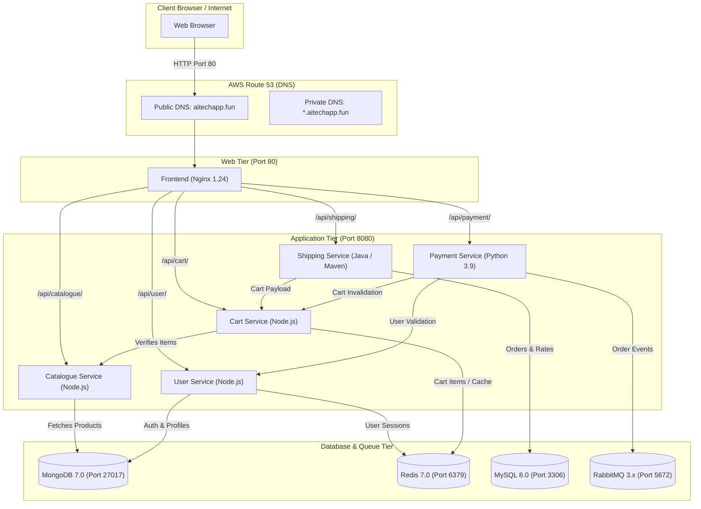
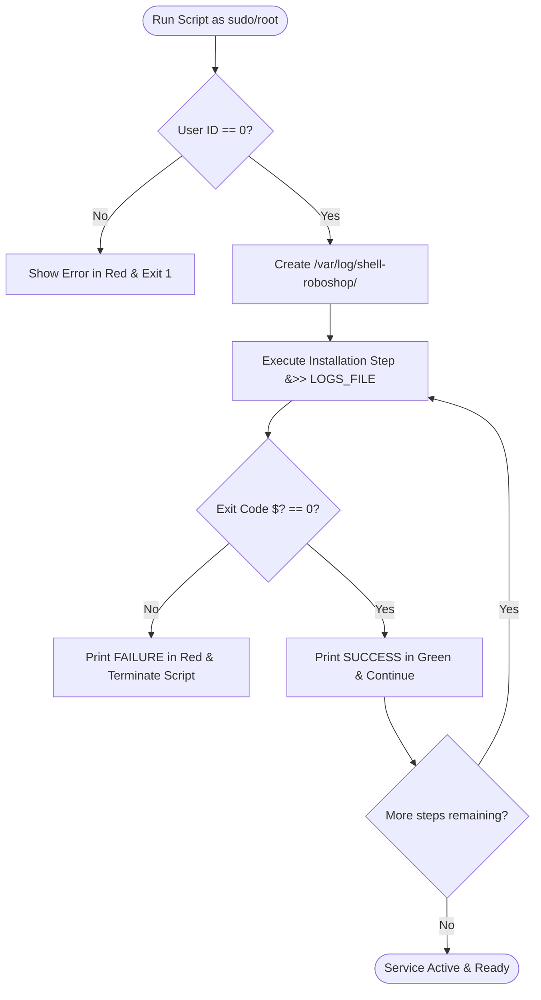
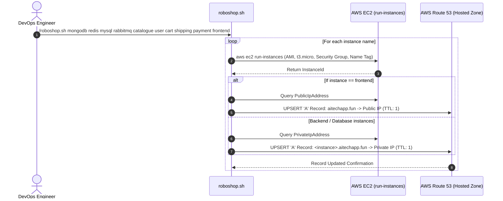
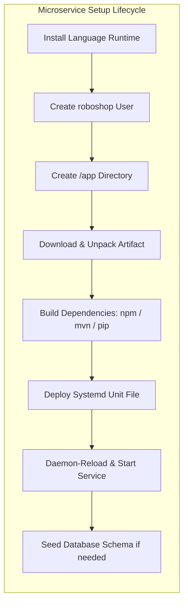
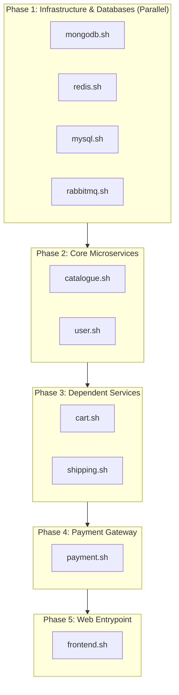

# RoboShop E-Commerce Deployment Automation with Shell Scripting

> Complete End-to-End Enterprise Automation Guide for deploying the RoboShop Multi-Tier Microservices Architecture on AWS RHEL (Red Hat Enterprise Linux) 9 using Shell Scripts, Systemd, and AWS CLI Route53 Integration.

---

## 📑 Table of Contents
1. [Project Overview](#project-overview)
2. [High-Level Architecture & Flowcharts](#high-level-architecture--flowcharts)
3. [Component & Microservices Matrix](#component--microservices-matrix)
4. [Shell Scripting Design Pattern & Standards](#shell-scripting-design-pattern--standards)
5. [Infrastructure Provisioning Flow (`roboshop.sh`)](#infrastructure-provisioning-flow-roboshopsh)
6. [Step-by-Step Component Deep Dive](#step-by-step-component-deep-dive)
   - [Database Tier (MongoDB, Redis, MySQL, RabbitMQ)](#1-database-tier)
   - [Backend Application Tier (Catalogue, User, Cart, Shipping, Payment)](#2-backend-application-tier)
   - [Web Tier (Frontend / Nginx Reverse Proxy)](#3-web-tier)
7. [Recommended Deployment Order](#recommended-deployment-order)
8. [Verification, Health Checks & Troubleshooting](#verification-health-checks--troubleshooting)

---

## Project Overview

RoboShop is a full-featured e-commerce platform built using a modern **microservices architecture**. Rather than running a monolithic codebase, the application is divided into autonomous services (Node.js, Java, Python) that communicate over HTTP REST APIs, AMQP message queues, and dedicated databases (MongoDB, Redis, MySQL).

### Why Shell Scripting Automation?
* **Eliminates Manual Configuration:** Configures packages, user creation, systemd services, firewall, and reverse proxy identically across all instances.
* **Idempotency & Re-entrancy:** Scripts inspect system state (e.g., verifying if a user or schema already exists) before executing, preventing duplicate errors.
* **Centralized Logging:** Standardizes execution logging into `/var/log/shell-roboshop/` with timestamping and color-coded status reporting (`SUCCESS` / `FAILURE`).
* **Automated DNS Binding:** AWS CLI integrates directly with Route53 to dynamically register private and public IP addresses.

---

## High-Level Architecture & Flowcharts

### 1. System Request Flow & Microservice Dependencies
The diagram below illustrates how client traffic travels from the browser through Route 53, into the Nginx Reverse Proxy, and distributes across backend microservices and databases:



---

## Component & Microservices Matrix

| Component | Technology / Runtime | Port | Backend Dependencies | Primary Configuration / Service Files |
| :--- | :--- | :--- | :--- | :--- |
| **MongoDB** | MongoDB 7.0 Community | `27017` | None | [mongodb.sh](file:///Users/sriramcharankolla/Desktop/DevOps/shell-roboshop/mongodb.sh), [mongo.repo](file:///Users/sriramcharankolla/Desktop/DevOps/shell-roboshop/mongo.repo) |
| **Redis** | Redis 7.0 In-Memory | `6379` | None | [redis.sh](file:///Users/sriramcharankolla/Desktop/DevOps/shell-roboshop/redis.sh) |
| **MySQL** | MySQL Server 8.0 | `3306` | None | [mysql.sh](file:///Users/sriramcharankolla/Desktop/DevOps/shell-roboshop/mysql.sh) |
| **RabbitMQ** | Erlang / RabbitMQ Server | `5672` | None | [rabbitmq.sh](file:///Users/sriramcharankolla/Desktop/DevOps/shell-roboshop/rabbitmq.sh), [rabbitmq.repo](file:///Users/sriramcharankolla/Desktop/DevOps/shell-roboshop/rabbitmq.repo) |
| **Catalogue** | Node.js 20 | `8080` | MongoDB | [catalogue.sh](file:///Users/sriramcharankolla/Desktop/DevOps/shell-roboshop/catalogue.sh), [catalogue.service](file:///Users/sriramcharankolla/Desktop/DevOps/shell-roboshop/catalogue.service) |
| **User** | Node.js 20 | `8080` | MongoDB, Redis | [user.sh](file:///Users/sriramcharankolla/Desktop/DevOps/shell-roboshop/user.sh), [user.service](file:///Users/sriramcharankolla/Desktop/DevOps/shell-roboshop/user.service) |
| **Cart** | Node.js 20 | `8080` | Redis, Catalogue | [cart.sh](file:///Users/sriramcharankolla/Desktop/DevOps/shell-roboshop/cart.sh), [cart.service](file:///Users/sriramcharankolla/Desktop/DevOps/shell-roboshop/cart.service) |
| **Shipping** | Java 17 / Maven | `8080` | MySQL, Cart | [shipping.sh](file:///Users/sriramcharankolla/Desktop/DevOps/shell-roboshop/shipping.sh), [shipping.service](file:///Users/sriramcharankolla/Desktop/DevOps/shell-roboshop/shipping.service) |
| **Payment** | Python 3.9 / pip3 | `8080` | RabbitMQ, User, Cart | [payment.sh](file:///Users/sriramcharankolla/Desktop/DevOps/shell-roboshop/payment.sh), [payment.service](file:///Users/sriramcharankolla/Desktop/DevOps/shell-roboshop/payment.service) |
| **Frontend** | Nginx 1.24 / HTML & JS | `80` | All microservices | [frontend.sh](file:///Users/sriramcharankolla/Desktop/DevOps/shell-roboshop/frontend.sh), [nginx.conf](file:///Users/sriramcharankolla/Desktop/DevOps/shell-roboshop/nginx.conf) |

---

## Shell Scripting Design Pattern & Standards

All provisioning scripts follow a consistent enterprise standard for safety, reusability, and debugging:



### Core Standards Implemented:
1. **Root Privilege Check:**
   Every script executes `USERID=$(id -u)`. If not equal to `0`, execution halts immediately to prevent partial, unprivileged installations.
2. **Standardized `VALIDATE` Function:**
   ```bash
   VALIDATE(){
       if [ $1 -ne 0 ]; then
           echo -e "$2 ... \e[31m FAILURE \e[0m" | tee -a $LOGS_FILE
           exit 1
       else
           echo -e "$2 ... \e[32m SUCCESS \e[0m" | tee -a $LOGS_FILE
       fi
   }
   ```
3. **App System User:**
   Microservices run under a non-interactive system account (`roboshop`) with home directory `/app` and shell `/sbin/nologin` to adhere to the principle of least privilege.
4. **Log Retention:**
   Stdout and Stderr are appended to `/var/log/shell-roboshop/<script-name>.log`.

---

## Infrastructure Provisioning Flow (`roboshop.sh`)

The script [roboshop.sh](file:///Users/sriramcharankolla/Desktop/DevOps/shell-roboshop/roboshop.sh#L1-L63) automates creating AWS EC2 instances and provisioning Route 53 DNS records across the fleet.



### Line-by-Line Flow in [roboshop.sh](file:///Users/sriramcharankolla/Desktop/DevOps/shell-roboshop/roboshop.sh#L1-L63):
* [roboshop.sh:L3-L6](file:///Users/sriramcharankolla/Desktop/DevOps/shell-roboshop/roboshop.sh#L3-L6): Defines AWS security group ID, RHEL 9 AMI ID, Route 53 Hosted Zone ID, and domain (`aitechapp.fun`).
* [roboshop.sh:L8-L16](file:///Users/sriramcharankolla/Desktop/DevOps/shell-roboshop/roboshop.sh#L8-L16): Loops over all CLI arguments (`$@`), launching a `t3.micro` EC2 instance tagged with the service name.
* [roboshop.sh:L18-L34](file:///Users/sriramcharankolla/Desktop/DevOps/shell-roboshop/roboshop.sh#L18-L34): Checks if the instance is `frontend`; extracts the **Public IP** for apex domain resolution, or extracts the **Private IP** for internal DNS resolution (`<service>.aitechapp.fun`).
* [roboshop.sh:L38-L62](file:///Users/sriramcharankolla/Desktop/DevOps/shell-roboshop/roboshop.sh#L38-L62): Executes `aws route53 change-resource-record-sets` using action `UPSERT` with low TTL (`1s`) to enable fast DNS propagation.

---

## Step-by-Step Component Deep Dive

### 1. Database Tier

#### A. MongoDB ([mongodb.sh](file:///Users/sriramcharankolla/Desktop/DevOps/shell-roboshop/mongodb.sh#L1-L43))
* **Purpose:** Stores catalog products and user registration profiles.
* **Configuration:** [mongo.repo](file:///Users/sriramcharankolla/Desktop/DevOps/shell-roboshop/mongo.repo#L1-L7) defines official MongoDB 7.0 yum repository.
* **Line-by-Line Execution:**
  * [mongodb.sh:L27-L28](file:///Users/sriramcharankolla/Desktop/DevOps/shell-roboshop/mongodb.sh#L27-L28): Copies `mongo.repo` to `/etc/yum.repos.d/`.
  * [mongodb.sh:L30-L31](file:///Users/sriramcharankolla/Desktop/DevOps/shell-roboshop/mongodb.sh#L30-L31): Installs `mongodb-org`.
  * [mongodb.sh:L33-L37](file:///Users/sriramcharankolla/Desktop/DevOps/shell-roboshop/mongodb.sh#L33-L37): Enables and starts `mongod` service.
  * [mongodb.sh:L39-L43](file:///Users/sriramcharankolla/Desktop/DevOps/shell-roboshop/mongodb.sh#L39-L43): Changes default bind IP from `127.0.0.1` to `0.0.0.0` in `/etc/mongod.conf` allowing remote access from backend microservices, then restarts `mongod`.

#### B. Redis ([redis.sh](file:///Users/sriramcharankolla/Desktop/DevOps/shell-roboshop/redis.sh#L1-L39))
* **Purpose:** In-memory caching for user shopping cart items and user session states.
* **Line-by-Line Execution:**
  * [redis.sh:L27-L29](file:///Users/sriramcharankolla/Desktop/DevOps/shell-roboshop/redis.sh#L27-L29): Disables the default Redis stream and enables module `redis:7`.
  * [redis.sh:L31-L32](file:///Users/sriramcharankolla/Desktop/DevOps/shell-roboshop/redis.sh#L31-L32): Installs `redis` server.
  * [redis.sh:L34-L35](file:///Users/sriramcharankolla/Desktop/DevOps/shell-roboshop/redis.sh#L34-L35): Updates `/etc/redis/redis.conf` to bind on `0.0.0.0` and disables `protected-mode`.
  * [redis.sh:L37-L39](file:///Users/sriramcharankolla/Desktop/DevOps/shell-roboshop/redis.sh#L37-L39): Enables and starts the `redis` systemd service.

#### C. MySQL ([mysql.sh](file:///Users/sriramcharankolla/Desktop/DevOps/shell-roboshop/mysql.sh#L1-L36))
* **Purpose:** Relational database storing shipping data, cities, and distance calculation tables.
* **Line-by-Line Execution:**
  * [mysql.sh:L27-L28](file:///Users/sriramcharankolla/Desktop/DevOps/shell-roboshop/mysql.sh#L27-L28): Installs `mysql-server`.
  * [mysql.sh:L30-L32](file:///Users/sriramcharankolla/Desktop/DevOps/shell-roboshop/mysql.sh#L30-L32): Enables and starts `mysqld`.
  * [mysql.sh:L35-L36](file:///Users/sriramcharankolla/Desktop/DevOps/shell-roboshop/mysql.sh#L35-L36): Configures the root password to `RoboShop@1` using `mysql_secure_installation`.

#### D. RabbitMQ ([rabbitmq.sh](file:///Users/sriramcharankolla/Desktop/DevOps/shell-roboshop/rabbitmq.sh#L1-L41))
* **Purpose:** Message broker buffering asynchronous order processing messages for payment transactions.
* **Configuration:** [rabbitmq.repo](file:///Users/sriramcharankolla/Desktop/DevOps/shell-roboshop/rabbitmq.repo#L1-L26) packages Erlang and RabbitMQ repositories.
* **Line-by-Line Execution:**
  * [rabbitmq.sh:L29-L33](file:///Users/sriramcharankolla/Desktop/DevOps/shell-roboshop/rabbitmq.sh#L29-L33): Configures YUM repository and installs `rabbitmq-server`.
  * [rabbitmq.sh:L35-L37](file:///Users/sriramcharankolla/Desktop/DevOps/shell-roboshop/rabbitmq.sh#L35-L37): Enables and starts `rabbitmq-server`.
  * [rabbitmq.sh:L39-L41](file:///Users/sriramcharankolla/Desktop/DevOps/shell-roboshop/rabbitmq.sh#L39-L41): Creates user `roboshop` with password `roboshop123` and grants full permissions (`".*" ".*" ".*"`).

---

### 2. Backend Application Tier



#### A. Catalogue ([catalogue.sh](file:///Users/sriramcharankolla/Desktop/DevOps/shell-roboshop/catalogue.sh#L1-L85))
* **Runtime:** Node.js 20.
* **Systemd Service:** [catalogue.service](file:///Users/sriramcharankolla/Desktop/DevOps/shell-roboshop/catalogue.service#L1-L14) injects `MONGO_URL="mongodb://mongodb.aitechapp.fun:27017/catalogue"`.
* **Key Steps:**
  * [catalogue.sh:L29-L36](file:///Users/sriramcharankolla/Desktop/DevOps/shell-roboshop/catalogue.sh#L29-L36): Switches Node.js module stream to `nodejs:20` and installs runtime.
  * [catalogue.sh:L38-L47](file:///Users/sriramcharankolla/Desktop/DevOps/shell-roboshop/catalogue.sh#L38-L47): Creates system user `roboshop` and `/app` directory.
  * [catalogue.sh:L49-L62](file:///Users/sriramcharankolla/Desktop/DevOps/shell-roboshop/catalogue.sh#L49-L62): Downloads `catalogue-v3.zip`, unzips to `/app`, runs `npm install`.
  * [catalogue.sh:L64-L70](file:///Users/sriramcharankolla/Desktop/DevOps/shell-roboshop/catalogue.sh#L64-L70): Copies unit file, reloads systemd, and starts `catalogue`.
  * [catalogue.sh:L72-L83](file:///Users/sriramcharankolla/Desktop/DevOps/shell-roboshop/catalogue.sh#L72-L83): Checks if product catalogue schema already exists using `mongosh`; if absent, loads `/app/db/master-data.js`.

#### B. User ([user.sh](file:///Users/sriramcharankolla/Desktop/DevOps/shell-roboshop/user.sh#L1-L70))
* **Runtime:** Node.js 20.
* **Systemd Service:** [user.service](file:///Users/sriramcharankolla/Desktop/DevOps/shell-roboshop/user.service#L1-L15) injects:
  * `REDIS_URL='redis://redis.aitechapp.fun:6379'`
  * `MONGO_URL="mongodb://mongodb.aitechapp.fun:27017/users"`
* **Key Steps:** Installs Node.js 20, extracts `user-v3.zip`, builds `npm install`, registers and starts systemd unit `user.service`.

#### C. Cart ([cart.sh](file:///Users/sriramcharankolla/Desktop/DevOps/shell-roboshop/cart.sh#L1-L70))
* **Runtime:** Node.js 20.
* **Systemd Service:** [cart.service](file:///Users/sriramcharankolla/Desktop/DevOps/shell-roboshop/cart.service#L1-L13) defines endpoints for `REDIS_HOST=redis.aitechapp.fun` and `CATALOGUE_HOST=catalogue.aitechapp.fun`.
* **Key Steps:** Installs Node.js 20, extracts `cart-v3.zip`, runs `npm install`, enables and starts `cart.service`.

#### D. Shipping ([shipping.sh](file:///Users/sriramcharankolla/Desktop/DevOps/shell-roboshop/shipping.sh#L1-L81))
* **Runtime:** Java 17 + Maven.
* **Systemd Service:** [shipping.service](file:///Users/sriramcharankolla/Desktop/DevOps/shell-roboshop/shipping.service#L1-L13) defines `CART_ENDPOINT=cart.aitechapp.fun:8080` and `DB_HOST=mysql.aitechapp.fun`.
* **Key Steps:**
  * [shipping.sh:L29-L30](file:///Users/sriramcharankolla/Desktop/DevOps/shell-roboshop/shipping.sh#L29-L30): Installs `maven`.
  * [shipping.sh:L43-L60](file:///Users/sriramcharankolla/Desktop/DevOps/shell-roboshop/shipping.sh#L43-L60): Unpacks `shipping-v3.zip`, builds Java executable via `mvn clean package`, and moves `target/shipping-1.0.jar` to `shipping.jar`.
  * [shipping.sh:L65-L77](file:///Users/sriramcharankolla/Desktop/DevOps/shell-roboshop/shipping.sh#L65-L77): Tests if `cities` schema exists in MySQL; if not, loads `schema.sql`, `app-user.sql`, and `master-data.sql`.
  * [shipping.sh:L79-L81](file:///Users/sriramcharankolla/Desktop/DevOps/shell-roboshop/shipping.sh#L79-L81): Starts `shipping.service`.

#### E. Payment ([payment.sh](file:///Users/sriramcharankolla/Desktop/DevOps/shell-roboshop/payment.sh#L1-L65))
* **Runtime:** Python 3.9 + gcc + python3-devel.
* **Systemd Service:** [payment.service](file:///Users/sriramcharankolla/Desktop/DevOps/shell-roboshop/payment.service#L1-L18) configures:
  * `CART_HOST=cart.aitechapp.fun`
  * `USER_HOST=user.aitechapp.fun`
  * `AMQP_HOST=rabbitmq.aitechapp.fun`, `AMQP_USER=roboshop`, `AMQP_PASS=roboshop123`
* **Key Steps:**
  * [payment.sh:L29-L30](file:///Users/sriramcharankolla/Desktop/DevOps/shell-roboshop/payment.sh#L29-L30): Installs Python runtime and build tools.
  * [payment.sh:L55-L57](file:///Users/sriramcharankolla/Desktop/DevOps/shell-roboshop/payment.sh#L55-L57): Installs dependencies with `pip3 install -r requirements.txt`.
  * [payment.sh:L59-L65](file:///Users/sriramcharankolla/Desktop/DevOps/shell-roboshop/payment.sh#L59-L65): Enables and starts `payment.service`.

---

### 3. Web Tier

#### Frontend ([frontend.sh](file:///Users/sriramcharankolla/Desktop/DevOps/shell-roboshop/frontend.sh#L1-L52)) & Reverse Proxy ([nginx.conf](file:///Users/sriramcharankolla/Desktop/DevOps/shell-roboshop/nginx.conf#L1-L62))

* **Runtime:** Nginx 1.24.
* **Role:** Serves static HTML/CSS/JS frontend assets and acts as an HTTP reverse proxy routing API endpoints to backend microservices.

```mermaid
flowchart LR
    subgraph Client
        Browser["User Browser"]
    end

    subgraph NginxServer ["Frontend Server (Nginx)"]
        NginxRoute{"Request URL"}
        StaticAssets["Static HTML/CSS/Images (/usr/share/nginx/html)"]
    end

    subgraph Microservices ["Internal Backend Services"]
        CatSvc["http://catalogue.aitechapp.fun:8080/"]
        UserSvc["http://user.aitechapp.fun:8080/"]
        CartSvc["http://cart.aitechapp.fun:8080/"]
        ShipSvc["http://shipping.aitechapp.fun:8080/"]
        PaySvc["http://payment.aitechapp.fun:8080/"]
    end

    Browser --> NginxRoute
    NginxRoute -->|"/" or "/images/"| StaticAssets
    NginxRoute -->|"/api/catalogue/"| CatSvc
    NginxRoute -->|"/api/user/"| UserSvc
    NginxRoute -->|"/api/cart/"| CartSvc
    NginxRoute -->|"/api/shipping/"| ShipSvc
    NginxRoute -->|"/api/payment/"| PaySvc
```

* **Key Reverse Proxy Rules in [nginx.conf](file:///Users/sriramcharankolla/Desktop/DevOps/shell-roboshop/nginx.conf#L50-L54):**
  * `location /api/catalogue/ { proxy_pass http://catalogue.aitechapp.fun:8080/; }`
  * `location /api/user/      { proxy_pass http://user.aitechapp.fun:8080/; }`
  * `location /api/cart/      { proxy_pass http://cart.aitechapp.fun:8080/; }`
  * `location /api/shipping/  { proxy_pass http://shipping.aitechapp.fun:8080/; }`
  * `location /api/payment/   { proxy_pass http://payment.aitechapp.fun:8080/; }`

---

## Recommended Deployment Order

Because microservices rely on databases and upstream services, deployment must follow a structured order:



### Execution Steps:

1. **Step 1: Launch EC2 & Route53 Records**
   Run from your workstation/bastion with configured AWS credentials:
   ```bash
   chmod +x roboshop.sh
   ./roboshop.sh mongodb redis mysql rabbitmq catalogue user cart shipping payment frontend
   ```

2. **Step 2: Install Databases**
   SSH into respective database servers and run:
   ```bash
   sudo bash mongodb.sh
   sudo bash redis.sh
   sudo bash mysql.sh
   sudo bash rabbitmq.sh
   ```

3. **Step 3: Install Core Backend Services**
   ```bash
   sudo bash catalogue.sh
   sudo bash user.sh
   ```

4. **Step 4: Install Dependent Backend Services**
   ```bash
   sudo bash cart.sh
   sudo bash shipping.sh
   sudo bash payment.sh
   ```

5. **Step 5: Install Frontend Server**
   ```bash
   sudo bash frontend.sh
   ```

---

## Verification, Health Checks & Troubleshooting

### 1. Centralized Log Inspection
Every script writes output to `/var/log/shell-roboshop/`. If a script fails, inspect the log directly:
```bash
tail -f /var/log/shell-roboshop/<script_name>.sh.log
```

### 2. Service Status Checks
```bash
# Check if systemd services are active
sudo systemctl status catalogue
sudo systemctl status user
sudo systemctl status cart
sudo systemctl status shipping
sudo systemctl status payment
sudo systemctl status nginx

# Live systemd service logs
sudo journalctl -u catalogue -f
sudo journalctl -u shipping -f
```

### 3. Port Listening & Connectivity Verification
```bash
# Check if services are listening on port 8080 (or respective DB ports)
sudo netstat -lntp
# or
sudo ss -tulpn

# Check Nginx stub status
curl http://localhost/health
```

### 4. Route 53 DNS Verification
```bash
# Verify internal service DNS resolution
dig +short catalogue.aitechapp.fun
dig +short mongodb.aitechapp.fun

# Test connectivity from frontend to catalogue
curl http://catalogue.aitechapp.fun:8080/health
```
